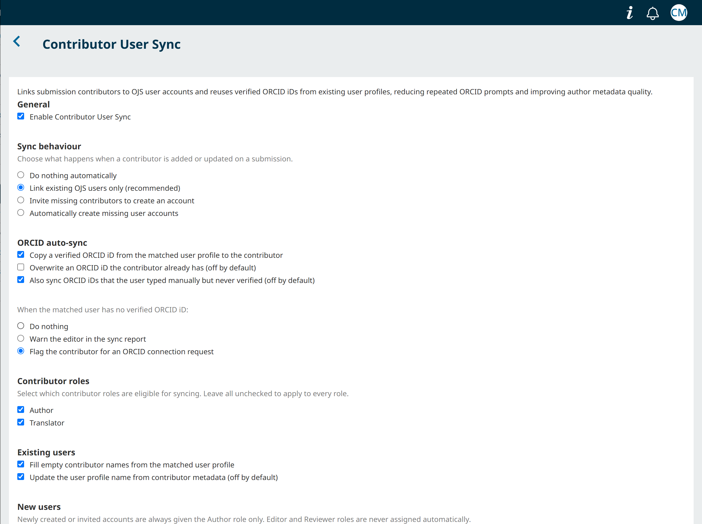
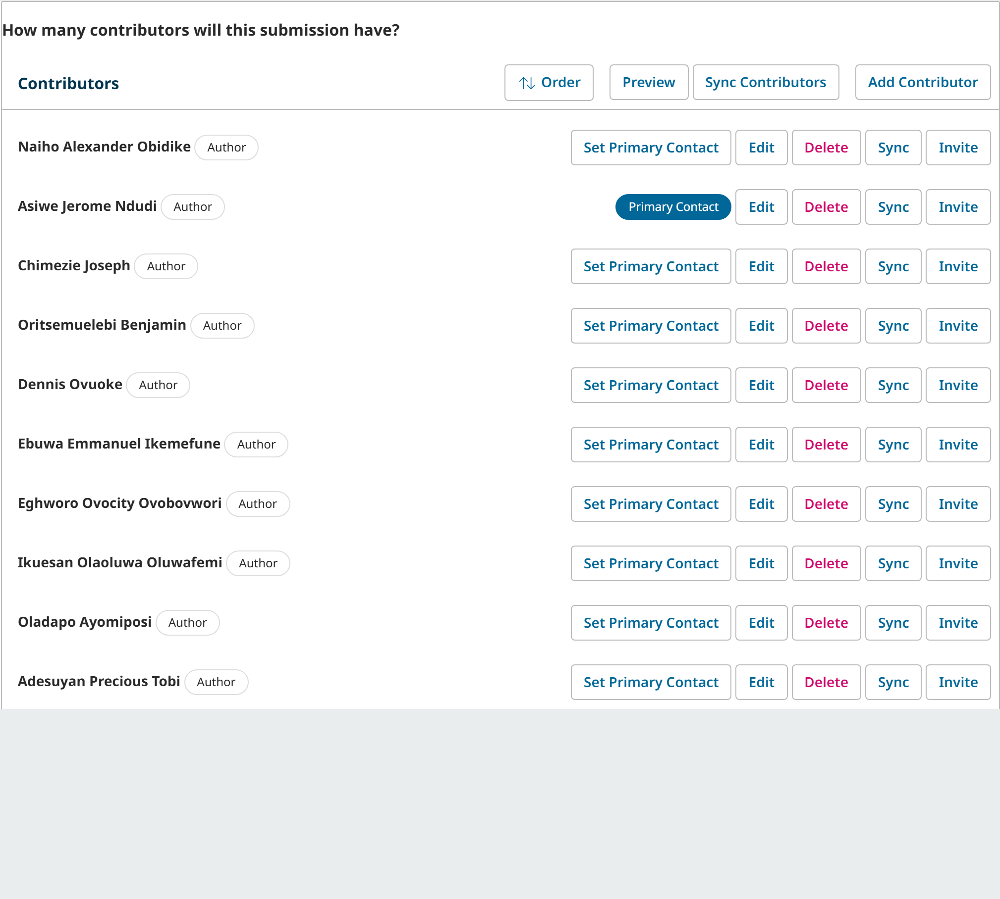
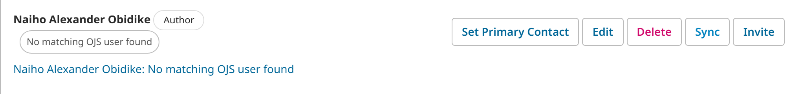
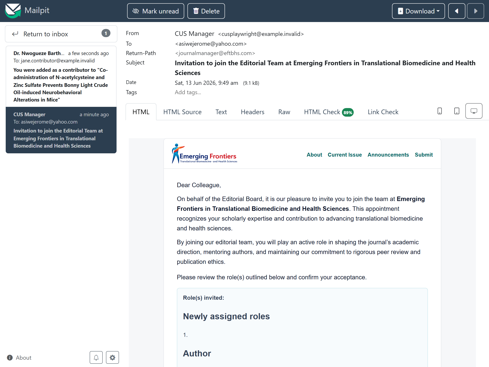
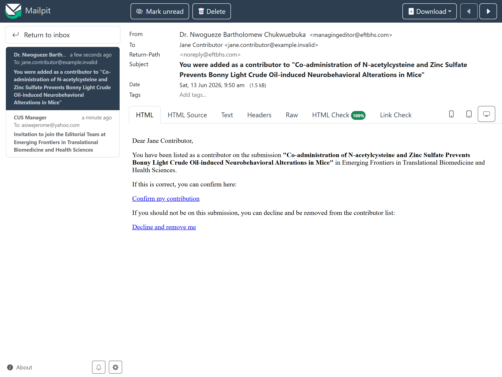
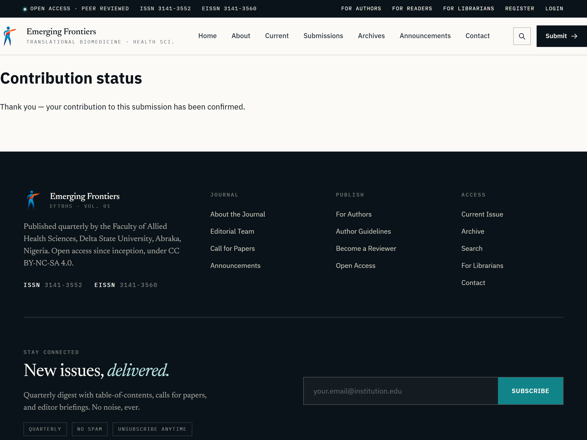
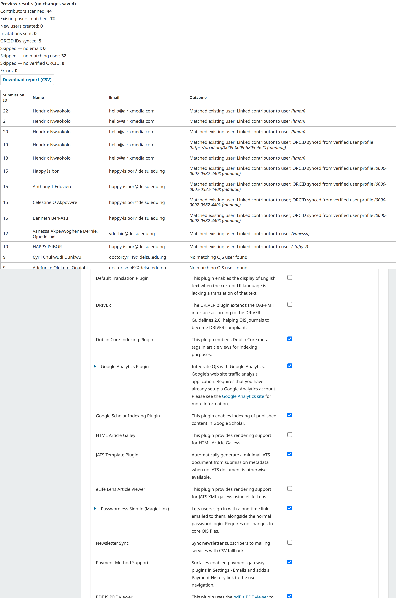
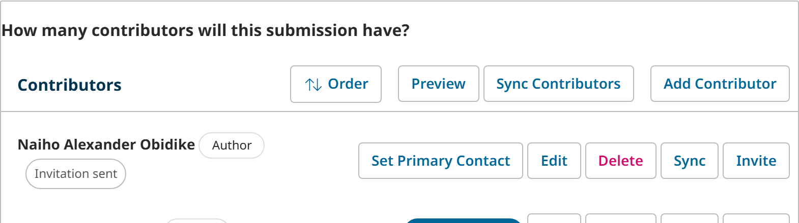

<div align="center">

# Contributor User Sync

### An OJS plugin that links submission contributors to real user accounts and reuses their **verified ORCID iDs** — automatically.

[](https://www.gnu.org/licenses/gpl-3.0)
[](https://pkp.sfu.ca/software/ojs/)
[](https://www.php.net/)
[](https://github.com/thathman/contributorUserSync/releases)
[](https://github.com/sponsors/thathman)

**[Features](#-features) · [Screenshots](#-screenshots) · [Install](#-installation) · [Configure](#%EF%B8%8F-configuration) · [How it works](#-how-it-works) · [Safety](#-safety--privacy) · [Sponsor](#-sponsor)**

</div>

---

> **Contributor User Sync links OJS submission contributors to user accounts and automatically reuses verified ORCID iDs from existing user profiles, reducing repeated ORCID prompts and improving author metadata quality.**

## The problem it solves

In OJS, a contributor/author listed on a submission is **not** necessarily connected to a
real OJS user account — the `authors` table has no `userId` column, so contributor metadata
and user accounts live independently. As a result:

- The same person is re-entered as a contributor on every submission, with no link back to
  their account.
- An author who has already connected and **verified** their ORCID iD in their user profile
  is still asked to connect ORCID *again*, per submission. This confuses authors and produces
  inconsistent — often missing — ORCID metadata.
- Editors have no quick way to tell which contributors correspond to real users, or to invite
  the ones who don't yet have accounts.

Contributor User Sync closes that gap: it matches contributors to existing users by email,
records the link, copies the user's already-verified ORCID iD into the submission's
contributor metadata, and gives editors one-click **Sync** / **Invite** actions plus a
journal-wide bulk tool.

---

## ✨ Features

| | Feature | What it does |
|---|---|---|
| 🔗 | **Contributor → user matching** | On add/edit, finds the OJS user with the same email and links them (stored as an author setting). |
| 🆔 | **Verified ORCID auto-sync** | Copies a *verified* ORCID iD (with its OAuth proof) from the matched user into the contributor, so they read as verified and are never re-prompted. |
| 🎛️ | **Four sync modes** | Do nothing · link existing users only · invite missing contributors · auto-create accounts. |
| 🧑‍🤝‍🧑 | **Role filtering** | Choose which contributor (author) roles are eligible for syncing. |
| 🖱️ | **Per-contributor actions** | **Sync** and **Invite** buttons on every contributor row, plus a panel-level **Sync Contributors**, with persistent status badges. |
| 📨 | **Real email invitations** | Missing contributors get an OJS invitation with an acceptance link and create their own account (Author role only — no emailed passwords). |
| 🔔 | **"You were added" notifications** | Optionally email contributors when added to a submission, with a **decline** link that removes them. |
| 📋 | **ORCID connection requests** | When a matched user has no verified ORCID, optionally email them OJS's ORCID authorization request. |
| 📊 | **Bulk sync + CSV report** | Scan every prior submission: preview (dry run) then apply, with a downloadable report. |
| 🔢 | **Submission-wizard count gate** | Optionally require the submitter to declare a contributor count and match it before submitting. |
| 🛡️ | **Safe by default** | Verified-only ORCID, never overwrites, never auto-creates, Author role only, multi-journal scoped. |

---

## 📸 Screenshots

> Captured live on OJS 3.5.

### Plugin settings
All behaviour in one place, grouped into clear sections.



### Per-contributor Sync / Invite + status badges
**Sync** and **Invite** sit beside the native contributor actions and match the theme; each
contributor shows a live status badge.





### Email invitation
A missing contributor receives a real OJS invitation with accept / decline links.



### "Added to submission" notification (with decline-to-remove)
The contributor is told which submission they were added to and can decline to be removed.





### Bulk sync report
Scan the whole journal, preview, then apply — with a downloadable CSV.



### Submission-wizard contributor-count gate


---

## 📦 Installation

**From the OJS Plugin Gallery** *(once published)*
> Dashboard → **Settings → Website → Plugins → Plugin Gallery** → search **Contributor User
> Sync** → **Install**.

**From a release archive**
1. Download `contributorUserSync.tar.gz` from the [Releases](https://github.com/thathman/contributorUserSync/releases) page.
2. Dashboard → **Settings → Website → Plugins → Upload A New Plugin**.
3. Enable **Contributor User Sync** under **Generic Plugins**.

**Manually (from source)**
```bash
cd ojs/plugins/generic
git clone https://github.com/thathman/contributorUserSync.git
```
No database upgrade is required — the plugin stores its data in standard plugin, author, and
publication settings.

---

## ⚙️ Configuration

Open the plugin's **Settings**. Sections:

- **General** — master enable.
- **Sync behaviour** — the four sync modes.
- **ORCID auto-sync** — copy verified ORCID; overwrite (off); allow manual (off); what to do
  when no verified ORCID exists (nothing / warn / send request).
- **Contributor roles** — which roles are eligible.
- **Existing users** — fill empty contributor names/affiliation from the profile; push names
  to the profile (off).
- **New users** — Author role only.
- **Contributor notifications** — notify on add (with decline); require a contributor count.
- **Bulk sync** — preview / run / export.

### Safe defaults

| Setting | Default |
|---|---|
| Plugin sync enabled | **Off** |
| Sync mode | **Link existing users only** |
| ORCID auto-sync (verified) | On |
| Overwrite existing contributor ORCID | Off |
| Sync manually entered ORCID | Off |
| Auto-create users | Off |
| Push contributor name to user profile | Off |
| Notify added contributors | Off |
| Require contributor count | Off |
| Created-user role | Author only |

Start with the defaults, run a **Bulk sync preview** to see what *would* change, then apply.

---

## 🔍 How it works

- **Matching** is by **email only** — name- or ORCID-only matching is intentionally avoided to
  prevent false positives.
- **The link** is stored as a plugin-owned author setting (`contributorUserSyncUserId`,
  registered on the author schema) because core OJS authors have no `userId` column. Synced
  ORCID values are written to the contributor's standard ORCID fields so they display and
  export normally.
- **ORCID** is only treated as verified when it carries `orcidIsVerified` from a completed
  ORCID OAuth flow. A manually typed profile iD is synced only if you explicitly allow it, and
  is then stored as **unverified**.
- **Invitations** use the OJS 3.5 invitation framework; on OJS 3.4 they fall back to a disabled
  "awaiting setup" Author account. No generated passwords are emailed.
- **Decline links** and the **confirm/decline page** are authenticated with a per-contributor
  key; declining deletes the contributor from the list.
- Everything is **scoped to the journal (context)** it runs in — safe on multi-journal
  installations.

---

## 🛡️ Safety & privacy

- Never overwrites an existing contributor ORCID unless explicitly enabled.
- Never treats an unverified/manual ORCID as verified.
- Never creates Editor or Reviewer accounts — only the Author role.
- Avoids emailing generated passwords; uses invitation / activation workflows.
- Never writes passwords or tokens to reports or logs.
- All manager actions are CSRF-protected.

---

## 🔄 Compatibility

| OJS | Status |
|---|---|
| **3.5** | ✅ Built and tested against (namespaced plugin API, `Hook::add`, `Repo::*`, `HasOrcid`, invitation framework). |
| **3.4** | ☑️ Core matching/ORCID paths share the same model; invitations fall back to disabled placeholder accounts. |
| **3.3** | ❌ Out of scope — uses the older array-based plugin/hook API and a different ORCID storage shape. |

---

## ❤️ Sponsor

Contributor User Sync is free and open source, built and maintained by
[**Hendrix Nwaokolo / Airix Media**](https://airixmedia.com). If it saves your editorial team
time, please consider sponsoring continued development and support:

<div align="center">

[](https://github.com/sponsors/thathman)
[](https://www.buymeacoffee.com/thathman)
[](https://airixmedia.com)

</div>

Sponsorship funds OJS-version compatibility updates, new features (richer reporting, more
notification options), and responsive issue support.

---

## 🤝 Contributing & support

- **Issues / feature requests:** [GitHub Issues](https://github.com/thathman/contributorUserSync/issues)
- **Pull requests** welcome — please run `php -l` on changed files and keep behaviour behind
  settings with safe defaults.

## ⚖️ License

GNU General Public License v3.0 — see [LICENSE](LICENSE).

© 2026 Hendrix Nwaokolo / Airix Media.
